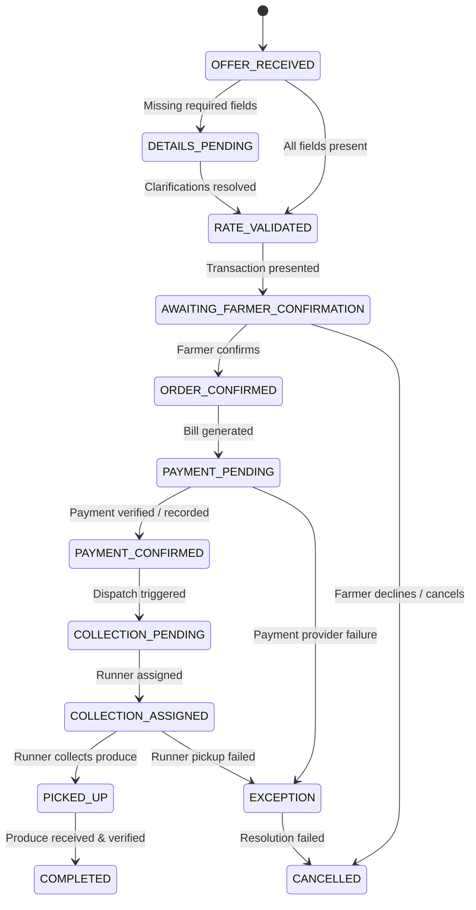

# Global AI Agricultural Procurement Agent — Architecture Document

## 1. Executive Summary & Vision

The **Global AI Agricultural Procurement Agent** is a farmer-facing conversational procurement system designed to bridge the gap between unstructured, natural-language produce offers from farmers and rigorous, auditable enterprise backend transactions.

### Core Philosophy (SRS v2.0)
> **"Global by architecture. Regional by configuration. AI for conversation. Backend for truth and execution."**

- **Global Core**: The conversation orchestrator, transaction lifecycle, billing engine, order state machine, and collection workflows remain geography-agnostic.
- **Regional Configuration**: Currency, measurement units, taxation, regional rate/pricing sources, and messaging/payment/logistics providers are decoupled into configuration and provider adapters.
- **Strict Boundary**: The AI/LLM handles language comprehension, user engagement, and parameter extraction. It **never** fabricates prices, directly mutates financial records, or bypasses backend state validation.

---

## 2. Architectural Paradigm: Modular Monolith

For the initial development stages and MVP, the system is architected as a **Modular Monolith**. 

### Why a Modular Monolith?
1. **Low Complexity & Zero Distributed Overhead**: Eliminates premature network boundaries, distributed transactions, and multi-service orchestration overhead during early stages.
2. **Strict In-Process Boundaries**: Modules communicate via explicit Python interfaces (service boundaries and domain DTOs), ensuring that modules can be cleanly extracted into independent microservices in the future if scale requires.
3. **Testability**: The entire end-to-end transaction flow can be comprehensively validated using fast in-memory or integration test suites without mocking external microservice clusters.

---

## 3. High-Level System Architecture

```
                                  [ Channel Layer ]
               WhatsApp Webhook / Web Chat / Test Console Interface
                                         │
                                         ▼
                               [ Messaging Adapter ]
                   Normalizes incoming/outgoing channel payloads
                                         │
                                         ▼
                             [ Agent Orchestrator ]
            ┌────────────────────────────────────────────────────────┐
            │  - Conversation Context Manager                        │
            │  - Intent Classifier (Produce Selling Detection)       │
            │  - Information Extractor (Produce, Quantity, Location) │
            │  - Clarification Engine (Targeted Questions)           │
            └────────────────────────────┬───────────────────────────┘
                                         │ Approved Tool Invocations
                                         ▼
                               [ Agent Tool Layer ]
               Type-safe, Pydantic-validated tool dispatchers
                                         │
                                         ▼
                            [ Business Service Layer ]
            ┌────────────────────────────────────────────────────────┐
            │  - Pricing Service (Authoritative Rate Lookups)        │
            │  - Order Service (Order State Machine & Lifecycle)     │
            │  - Billing Service (Deterministic Total Calculation)   │
            │  - Payment Service (Status & Settlement Tracking)      │
            │  - Collection Service (Pickup Tasks & Runner Dispatch) │
            └─────────────┬────────────────────────────┬─────────────┘
                          │                            │
                          ▼                            ▼
                 [ Adapter Boundary ]         [ Data Access Layer ]
          ┌───────────────────────────────┐   ┌───────────────────────────┐
          │ - Payment Adapters (Sandbox)  │   │ - SQLAlchemy 2.0 ORM      │
          │ - Logistics Adapters (Runners)│   │ - SQLite (Dev/Test)       │
          │ - Regional Config Providers   │   │ - PostgreSQL (Production) │
          └───────────────────────────────┘   └───────────────────────────┘
```

---

## 4. Separation of Concerns Matrix

To maintain safety, financial correctness, and auditability, system responsibilities are strictly partitioned:

| Functional Area | Conversational AI (LLM) Role | Deterministic Backend Services Role |
| :--- | :--- | :--- |
| **Language Understanding** | Understands slang, dialects, unstructured messages, informal units. | Normalizes data into canonical domain entities. |
| **Intent & Extraction** | Identifies produce offer, quantities, dates, and locations. | Validates whether produce is supported, units are valid, and coordinates are resolvable. |
| **Pricing & Valuation** | Explains rates clearly to the farmer; communicates totals. | **Source of truth**: Queries authoritative rate tables, government benchmarks, or buyer rules. LLM never invents rates. |
| **Calculations & Billing** | Presents bill breakdown to the user. | **Deterministic arithmetic**: `total = quantity * rate (+ taxes/fees)`. Validates precision and rounding. |
| **Order State** | Solicits confirmation ("Do you accept this transaction?"). | Enforces state machine transitions; rejects invalid or duplicate transitions. |
| **Payment** | Informs farmer of payment status and next steps. | Initiates transaction with payment provider, validates webhook receipts, records transaction IDs. |
| **Collection / Logistics** | Solicits pickup availability and communicates runner status. | Generates collection tasks, assigns runner IDs, handles dispatch and exception transitions. |

---

## 5. Order State Machine Specification

The order follows a strict 13-state lifecycle as defined in SRS Section 10:



### State Definitions
1. `OFFER_RECEIVED`: Initial farmer message with produce selling intent detected.
2. `DETAILS_PENDING`: Missing mandatory attributes (e.g., location, unit, pickup window).
3. `RATE_VALIDATED`: Validated produce and quantity matched against authoritative backend rate.
4. `AWAITING_FARMER_CONFIRMATION`: Proposed transaction summary presented; waiting for explicit farmer acceptance.
5. `ORDER_CONFIRMED`: Farmer accepted; unique immutable order record created.
6. `PAYMENT_PENDING`: Bill generated and payment initiated.
7. `PAYMENT_CONFIRMED`: Payment captured/verified by adapter.
8. `COLLECTION_PENDING`: Order queued for runner assignment.
9. `COLLECTION_ASSIGNED`: Runner assigned to pickup task.
10. `PICKED_UP`: Produce physically received from farmer by runner.
11. `COMPLETED`: Produce delivered and transaction closed.
12. `CANCELLED`: Transaction aborted prior to completion.
13. `EXCEPTION`: Unscheduled event (e.g., payment failure, runner no-show, quality mismatch).

---

## 6. Regional Configuration Model

To satisfy the **Global Product Scope Addendum (SRS v2.0)**, all regional specifics are decoupled into configuration profiles:

```python
class RegionalProfile(BaseModel):
    region_code: str               # e.g., "GLOBAL_DEFAULT", "US_CA", "IN_MH", "KE_RV"
    country_name: str
    currency_code: str              # ISO 4217, e.g., "USD", "EUR", "KES", "INR"
    currency_symbol: str            # e.g., "$", "KSh", "₹"
    standard_mass_units: list[str]  # e.g., ["kg", "quintal", "ton", "lb"]
    pricing_strategy: str           # "FIXED_PROCUREMENT_RATE", "BUYER_DEFINED", etc.
    payment_provider_key: str       # "SANDBOX_MOCK", "MPESA", "STRIPE", etc.
    logistics_provider_key: str     # "RUNNER_POOL", "LOCAL_DISPATCH"
    locale: str                     # Default: "en-US"
```

The core agent orchestrator references the active profile to format currencies, normalize weight units, and route to corresponding payment/logistics adapters without modifying business logic.

---

## 7. Modular Component Layout

```
src/orca/
├── core/         # Global configuration, logging, regional profiles
├── domain/       # State machine, domain entities, Pydantic schemas
├── services/     # Pure deterministic business logic (pricing, billing, orders, logistics)
├── agent/        # AI orchestration, prompt layers, tool definitions
├── adapters/     # Boundary implementations (WhatsApp, Mock Messaging, Sandbox Payment, Runner)
├── db/           # Persistence session management, SQLAlchemy repository interfaces
└── api/          # Webhook endpoints, Admin REST APIs, Dependency injection
```

---

## 8. Development Roadmap

- **Stage 0 (Current)**: Project foundation, modular architecture, core domain models, state machine, and regional configuration.
- **Stage 1 (Next Step)**: Authoritative pricing service, deterministic order & billing engine, and state machine validation tests.
- **Stage 2**: Conversational agent orchestration (intent classification, entity extraction, prompt engineering, structured tool execution).
- **Stage 3**: Payment and Collection adapters (mock sandbox provider and runner lifecycle).
- **Stage 4**: Channel integration (WhatsApp webhook adapter and interactive test harness).
